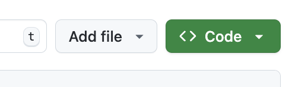
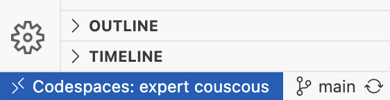
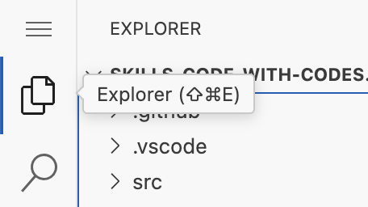
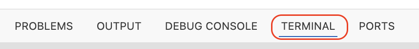

## Step 1: codespace を起動してコードを push する

### Codespaces の何がすごいのか

**codespace** は、クラウド上でホストされる開発環境です。リポジトリの中の設定ファイルで内容が決まります。プロジェクト専用の開発環境を何度でも同じ形で作れるので、新しい開発者の立ち上げが簡単になり、「自分のマシンでは動くのに」という有名なセリフを避けられます 😎

各 codespace は [Dev Container specification](https://containers.dev/implementors/spec/) に従い、GitHub が [Docker コンテナー](https://code.visualstudio.com/docs/devcontainers/containers)としてホストします。

でも心配は要りません。Docker の知識も、自分のマシンへの Docker のインストールも不要です。

> [!TIP]
> Dev Container の設定はリポジトリの一部なので、自分の Docker ホストを使ってローカルで動かすこともできます。

codespace には、ローカル開発と比べて次のような利点があります。

- リポジトリのページから直接 codespace を起動できる。
- ブラウザーで開発できる。IDE のインストールは不要。
  - ローカルにインストールした VS Code からリモートの codespace につなぐこともできる。
- プロジェクトの実行に必要なものを、あらかじめ設定しておける。
  - **[features](https://containers.dev/features)** を追加して、よく使う開発ツールを入れる。
  - codespace のライフサイクルの各段階でスクリプトを実行する _(例: python / npm のパッケージをインストールする)_。
  - プロジェクトに合わせて VS Code の設定と拡張機能を用意する。
- 通信が速い (コンテナーがデータセンター内にあるため)。

> [!TIP]
> codespace は、pull request のレビューのような短時間の用途でも役に立ちます。届いたコード変更を試すために、自分の環境が正しいかを確認する必要がありません。

始めましょう。codespace を起動し、アプリケーションを実行し、変更を加えて push します。普段の開発と同じ流れです 🤓

### ⌨️ やること: codespace を起動する

1. 2 つ目のタブを開き、このリポジトリを開きます。**Code** タブにいることを確認します。

1. ファイル一覧の右上にある緑色の **<> Code** ボタンをクリックします。

   

1. **Codespaces** タブを選び、**Create codespace on main** ボタンをクリックします。新しいウィンドウが開いて VS Code が起動し、リモートの codespace に接続します。作成には数分かかるので待ちます。

1. VS Code ウィンドウの左下を見て、リモート接続を確認します。

   

> [!TIP]
> リポジトリに設定が含まれていない場合、GitHub は [universal](https://github.com/devcontainers/images/tree/main/src/universal) の codespace イメージを使います。よく使われる便利なツールが一通り入っています。

### ⌨️ やること: アプリケーションを実行する

1. VS Code の codespace にいることを確認します。

1. 左のサイドバーで **Explorer** タブを選び、`src/hello.py` を開きます。

   

1. 下部パネルで **TERMINAL** タブを選びます。

   

1. codespace のリモートターミナルに次のコマンドを貼り付けて、入っているツールのバージョンを表示します。後で比較するのでバージョンを控えておきます。

   ```bash
   node --version
   dotnet --version
   python --version
   gh --version
   ```

1. 次のコマンドを貼り付けて、codespace のリモートターミナルで Python プログラムを実行します。

   ```bash
   python src/hello.py
   ```

### ⌨️ やること: codespace からリポジトリに変更を push する

1. `src/hello.py` の中身を次の内容に置き換えて、ファイルを保存します。

   ```py
   print("Hello World!")
   ```

1. メッセージを直したら、変更をコミットして GitHub に push します。VS Code のソース管理の機能を使うか、次のターミナルコマンドを使います。

   ```bash
   git add 'src/hello.py'
   git commit -m 'fix: incomplete hello message'
   git push
   ```

1. (任意) ブラウザーに戻って `src/hello.py` を開き、変更が反映されているか確認します。

1. 変更を GitHub に push したので、Mona が作業を確認しています。少し待って、コメントを見てください。進捗と次の Step が投稿されます。
