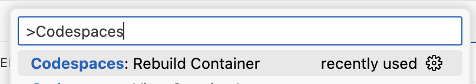

## Step 2: codespace でカスタムイメージを使う

さきほど作った codespace には、リポジトリ側の設定がありませんでした。設定がないため、GitHub は既定の Docker イメージを使いました。既定のイメージは便利ですが、内容が一定にならず、実行環境のバージョンも固定されません。開発環境を何度でも同じ形で作るには、設定を指定することが重要です。

使う Docker コンテナーイメージを指定してみます。

### codespace はどう設定するのか

設定はリポジトリの中の `.devcontainer/devcontainer.json` で直接指定します。設定を複数持つこともできます。

`devcontainer.json` を作り、よく使う設定をいくつか入れてみましょう。VS Code の設定、ポート転送、ライフサイクルスクリプトの実行といった他の項目については、GitHub の [Codespaces ドキュメント](https://docs.github.com/en/codespaces/setting-up-your-project-for-codespaces)を参照してください。

### ⌨️ やること: codespace をカスタマイズする

1. VS Code の codespace にいることを確認します。

1. VS Code のファイルエクスプローラーで、設定ファイルを作ります。

   ```txt
   .devcontainer/devcontainer.json
   ```

   または、次のターミナルコマンドでも作れます。

   ```bash
   mkdir -p .devcontainer
   touch .devcontainer/devcontainer.json
   ```

1. `.devcontainer/devcontainer.json` を開き、次の内容を追加します。まずは基本的なイメージから始めます。

   ```json
   {
     "name": "Basic Dev Environment",
     "image": "mcr.microsoft.com/devcontainers/base:debian"
   }
   ```

   > 💡 **ヒント**: name は任意ですが、設定が複数あるとき、GitHub で codespace を作る際に見分けやすくなります。

1. 保存すると、VS Code に設定の変更を検出したという通知が出ているはずです。**Accept** を選ぶと開発コンテナーが再ビルドされます。または、コマンドパレット (`CTRL`+`Shift`+`P`) から `Codespaces: Rebuild Container` を実行します。**Rebuild** を選びます。フルビルドは必要ありません。

   

1. codespace の再ビルドと VS Code の再接続に数分かかるので待ちます。

1. 下部パネルを開き、**TERMINAL** タブを選びます。

1. 次のコマンドでツールのバージョンをもう一度確認します。どれも入っていないことがわかります。

   ```bash
   node --version
   dotnet --version
   python --version
   gh --version
   ```

1. ⚠️ 現在、Codespaces には [Git-LFS](https://git-lfs.com/) がインストールされている前提になっている不具合があります。次のコマンドを実行して、影響を受ける Git フックを削除します。

   ```bash
   rm .git/hooks/post-checkout
   rm .git/hooks/post-commit
   rm .git/hooks/post-merge
   rm .git/hooks/pre-push
   ```

1. 新しい設定を確認できたので、変更をコミットします。VS Code のソース管理の機能を使うか、次のターミナルコマンドを使います。

   ```bash
   git add '.devcontainer/devcontainer.json'
   git commit -m 'feat: Add codespace configuration'
   git push
   ```

1. dev container の設定をコミットしたので、Mona が作業を確認しています。少し待って、コメントを見てください。進捗と次の Step が投稿されます。
