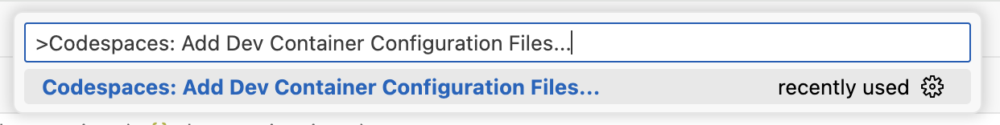
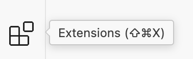
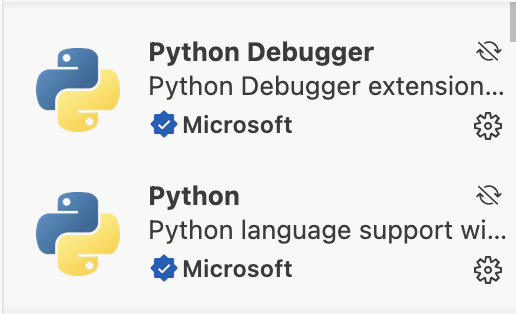
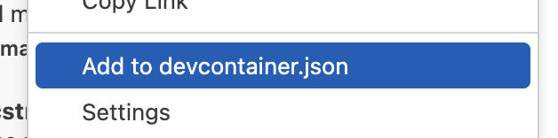
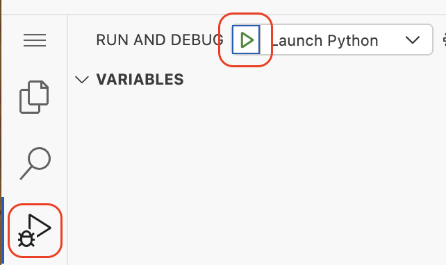

## Step 3: Features を追加する

コンテナーの feature、VS Code の拡張機能、VS Code の設定、ホストの要件など、さらに細かく codespace をカスタマイズできます。

GitHub CLI と、VS Code で Python プログラムを実行するための拡張機能、そして codespace の初回作成時にパッケージをインストールする独自スクリプトを追加します。

### ⌨️ やること: Python のサポートを追加する

1. VS Code でコマンドパレット (`CTRL`+`SHIFT`+`P`) を開き、次のコマンドを選びます。

   ```txt
   Codespaces: Add Dev Container Configuration Files...
   ```

   

1. `Modify your active configuration...` を選びます。

1. feature の一覧から `devcontainers` の `Python` を検索して選びます。

   - 既定値ではなく、`Configure Options` を選びます。
   - `Install Tools` は `true` のままにします。
   - Python のバージョンは `3.10` を選びます。

1. `.devcontainer/devcontainer.json` を開きます。

1. 次のような項目が追加されているか確認します。

   ```json
   "features": {
      "ghcr.io/devcontainers/features/python:1": {
         "installTools": true,
         "version": "3.10"
      }
   },
   ```

### ⌨️ やること: VS Code の拡張機能を追加する

1. 左のナビゲーションで **Extension** タブを選びます。

   

1. `python` を検索し、`Python` と `Python Debugger` を見つけます。

   

1. どちらも右クリックし、`Add to devcontainer.json` を選びます。

   

1. `.devcontainer/devcontainer.json` を開きます。

1. 次のような項目が追加されているか確認します。

   ```json
   "customizations": {
      "vscode": {
         "extensions": [
            "ms-python.python",
            "ms-python.debugpy"
         ]
      }
   },
   ```

### ⌨️ やること: 独自スクリプトを追加する

Dev Container specification には、codespace をさらにカスタマイズするための [ライフサイクルスクリプト](https://containers.dev/implementors/json_reference/#lifecycle-scripts) を実行できる場所が複数あります。初回ビルド (または再ビルド) の後に 1 回だけ実行される `postCreateCommand` を追加します。

1. VS Code のファイルエクスプローラーで、次の名前のスクリプトファイルを作ります。

   ```txt
   .devcontainer/postCreate.sh
   ```

   または、次のターミナルコマンドでも作れます。

   ```bash
   touch .devcontainer/postCreate.sh
   ```

1. 次のターミナルコマンドで、スクリプトを実行可能にします。

   ```bash
   chmod +x .devcontainer/postCreate.sh
   ```

1. `.devcontainer/postCreate.sh` を開き、次のコードを追加します。蒸気機関車のアニメーションをインストールする内容です。

   ```bash
   #!/bin/bash

   sudo apt-get update
   sudo apt-get install sl
   echo "export PATH=\$PATH:/usr/games" >> ~/.bashrc
   echo "export PATH=\$PATH:/usr/games" >> ~/.zshrc
   ```

1. `.devcontainer/devcontainer.json` を開きます。

1. `features` や `customizations` と同じ階層 (_トップレベル_) に `postCreateCommand` の項目を作ります。

   ```json
   "postCreateCommand": ".devcontainer/postCreate.sh"
   ```

1. 新しい設定ができたので、変更をコミットします。VS Code のソース管理の機能を使うか、次のターミナルコマンドを使います。

   ```shell
   git add '.devcontainer/devcontainer.json'
   git add '.devcontainer/postCreate.sh'
   git commit -m 'feat: Add features, extensions, and postCreate script'
   git push
   ```

1. VS Code のコマンドパレット (`CTRL`+`Shift`+`P`) を開き、`Codespaces: Rebuild Container` を実行します。**Rebuild** を選びます。フルビルドは必要ありません。

   

1. codespace の再ビルドと VS Code の再接続に数分かかるので待ちます。

1. カスタマイズをコミットしたので、Mona が作業を確認しています。少し待って、コメントを見てください。進捗と次の Step が投稿されます。

> [!TIP]
> アカウントに [dotfiles をインストールする](https://docs.github.com/en/codespaces/setting-your-user-preferences/personalizing-github-codespaces-for-your-account)設定もできます。個人の設定とプロジェクトの設定を組み合わせられます。

### ⌨️ やること: (任意) カスタマイズを確認する

codespace を再ビルドしたので、Python の拡張機能、Python のバージョン、独自スクリプトが正しく反映されたか確認します。

1. codespace にいることを確認します。

1. 左のサイドバーで拡張機能タブをクリックし、Python の拡張機能がインストールされ、有効になっているか確認します。

   

1. 左のサイドバーで **Run and Debug** タブを選び、**Start Debugging** のアイコンを押します。VS Code が下部パネルを開き、実行ログを表示します。

   

1. 下部パネルで **TERMINAL** タブに切り替えます。

1. 次のコマンドを実行して、入っている Python のバージョンを表示します。他のツールは入っていないことがわかります。

   ```bash
   node --version
   dotnet --version
   python --version
   gh --version
   ```

1. 次のコマンドを実行して、蒸気機関車のアニメーションを表示します。

   ```bash
   sl
   ```
