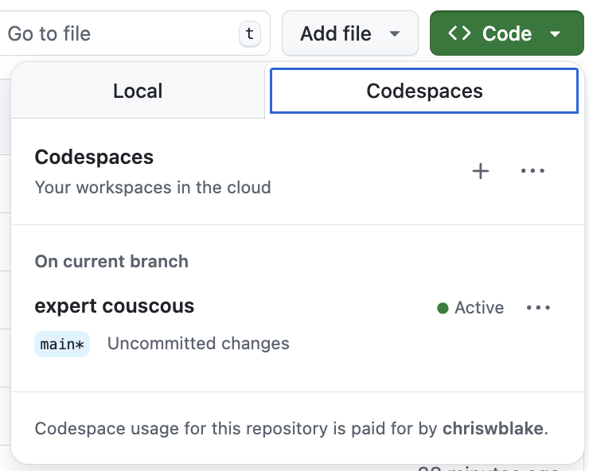
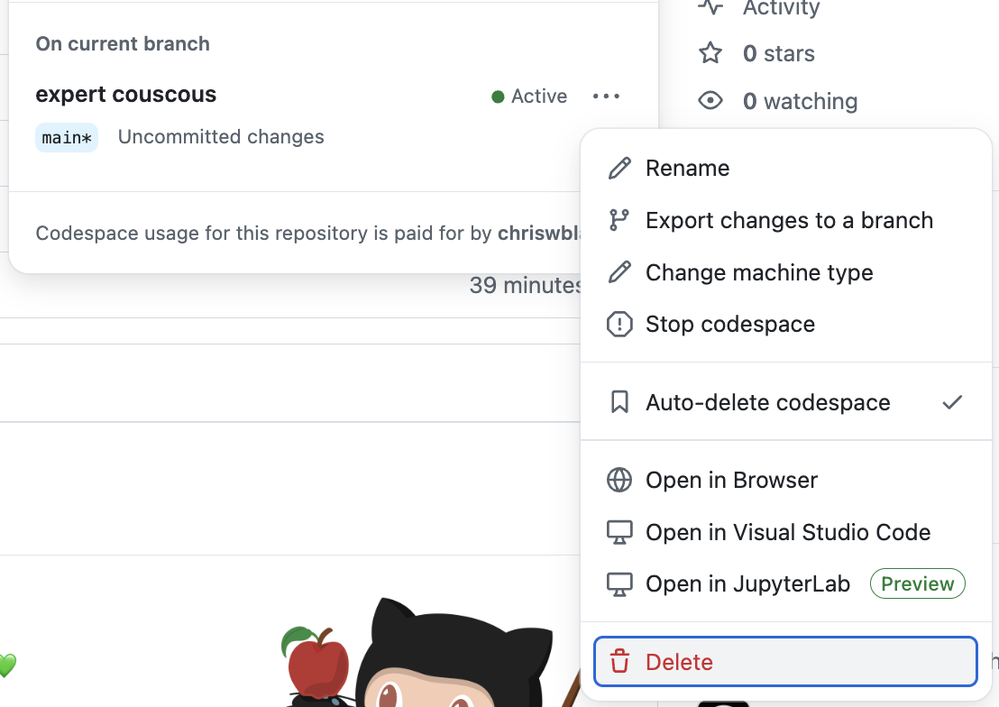

## Step 4: 作った Codespace を試す

最後のテストとして、新しく参加した開発者の立場になってみます。いったんすべて閉じて、何もない状態から新しい codespace を起動します。

### ⌨️ やること: 今ある codespace を削除する

1. VS Code の codespace を実行しているウィンドウを閉じます。

1. 演習用のリポジトリを開きます。

1. ファイル一覧の右上にある緑色の **<> Code** ボタンをクリックします。

1. **Codespaces** タブを選び、作成済みの codespace の一覧を表示します。

   

1. 動いているものを見つけ、三点メニュー `...` から **Delete** を選びます。

   

> [!TIP]
> すべてのプロジェクトの codespace は https://github.com/codespaces でまとめて管理できます。

### ⌨️ やること: codespace を起動する

1. ファイル一覧の右上にある緑色の **<> Code** ボタンをクリックします。

1. **Codespaces** タブを選び、**プラス記号** `+` または **Create codespace on main** ボタンをクリックします。

   > 三点メニュー `...` を選ぶと、マシンの種類、リージョン、設定を変えることもできます。

1. codespace の作成と VS Code の接続に数分かかるので待ちます。

1. (任意) 前の Step でやったことをいくつか試して、同じように動くか確かめます。

1. テストが終わったことを Mona に知らせるため、Issue にコメントを追加します。コメント後、最終レビューが投稿されるまで少し待ちます。

   ```md
   Hey @professortocat, I've finished testing out my new Codespace.
   I'm ready to review!
   ```

1. お疲れさまでした。完了です！ 🎉
